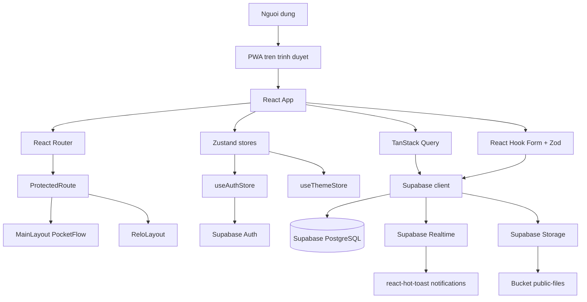
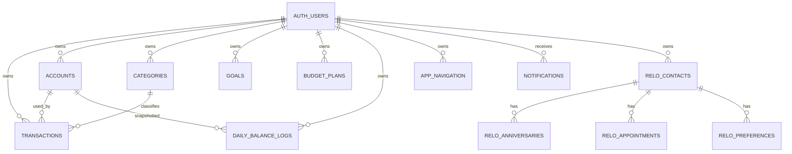
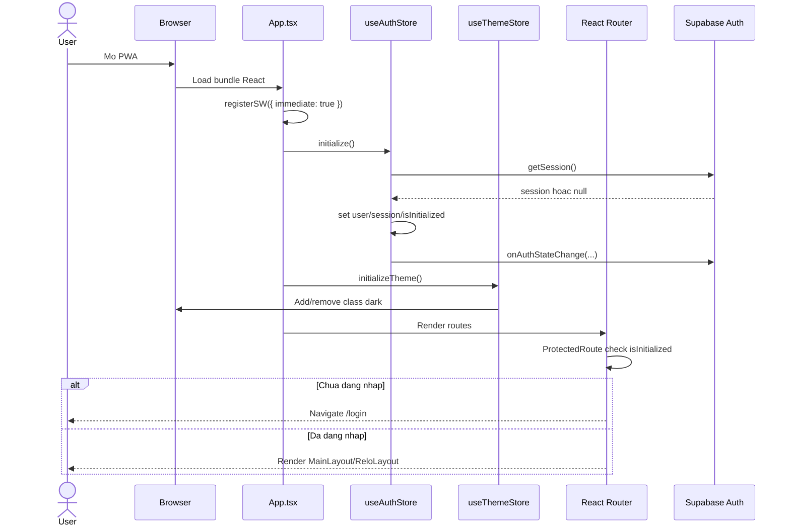
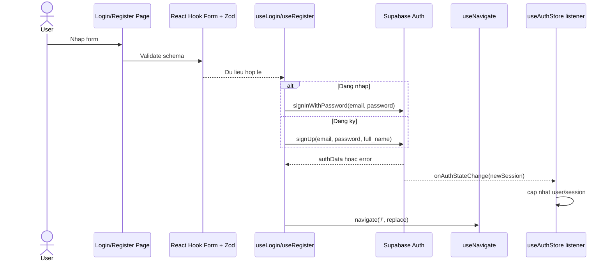
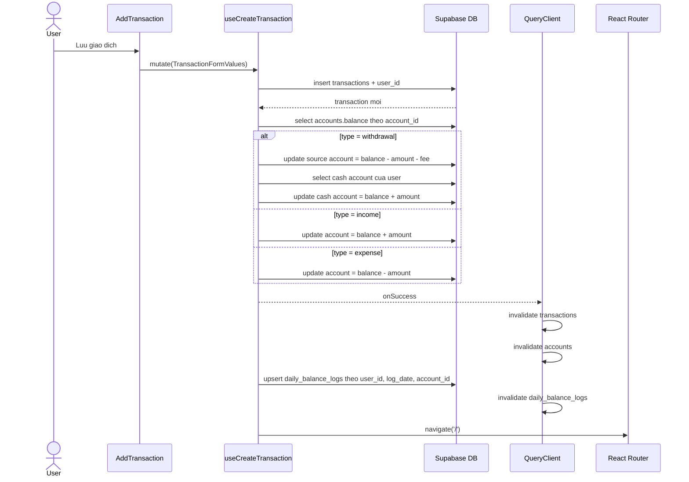
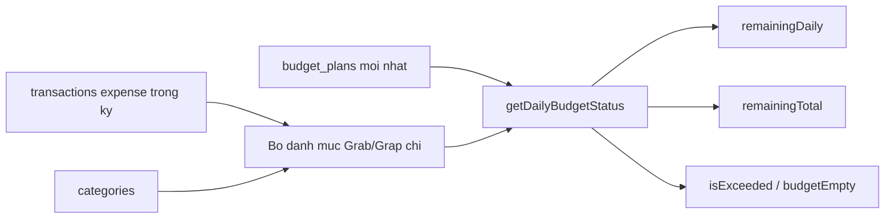
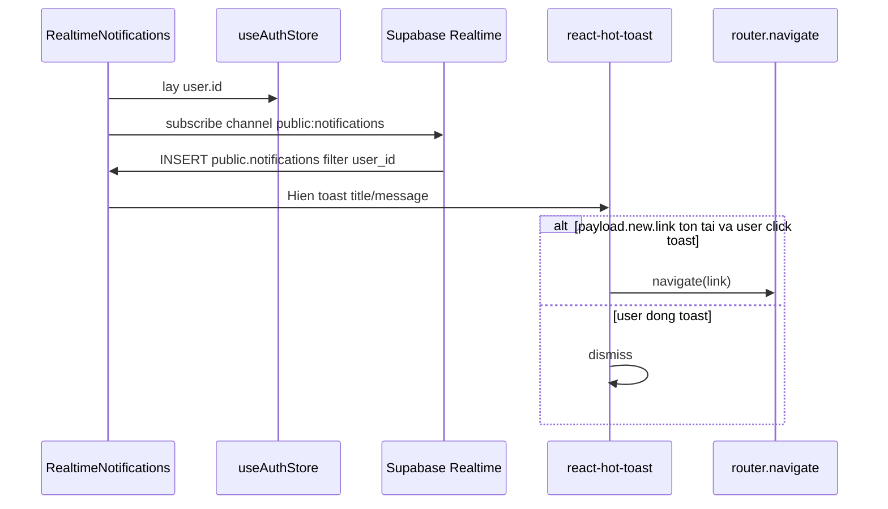
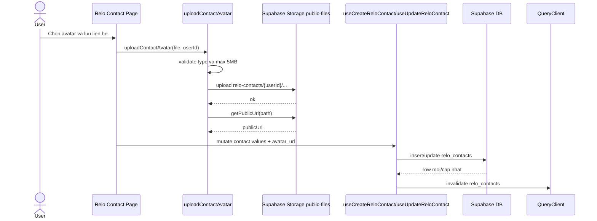

# PocketWebApp - Tai lieu mo ta he thong

Tai lieu nay duoc tong hop tu ma nguon hien tai cua du an PocketWebApp. Muc tieu la giup nguoi doc nam nhanh kien truc, module chuc nang, bang du lieu, luong xu ly va cac diem tich hop chinh.

## 1. Tong quan

PocketWebApp la mot PWA viet bang React + TypeScript + Vite, dung Supabase lam backend chinh. Ung dung co hai mien chuc nang:

| Mien | Mo ta | Route chinh |
| --- | --- | --- |
| PocketFlow | Quan ly tai chinh ca nhan: giao dich, vi/tai khoan, danh muc, thong ke, muc tieu, ngan sach. | `/`, `/ledger`, `/wallet`, `/stats`, `/budget`, `/settings/*` |
| Relo | Quan ly moi quan he: lien he, ngay ky niem, lich hen, so thich, avatar. | `/relo/*` |

Nguoi dung phai dang nhap qua Supabase Auth de truy cap cac route duoc bao ve.

## 2. Tech stack

| Lop | Cong nghe | Vai tro |
| --- | --- | --- |
| UI | React 19, React DOM | Render giao dien SPA |
| Build | Vite 7 | Dev server, build, PWA plugin |
| Language | TypeScript | Kieu du lieu va an toan compile |
| Routing | React Router DOM v7 | Dinh tuyen, nested route, redirect |
| Server state | TanStack Query v5 | Fetch, cache, invalidate query |
| Client state | Zustand | Auth state, theme state |
| Backend/BaaS | Supabase | Auth, PostgreSQL, Realtime, Storage |
| Form | React Hook Form, Zod | Quan ly form va validate du lieu |
| UI utilities | Tailwind CSS, clsx, tailwind-merge, lucide-react, PrimeReact Chart | Styling, icon, chart |
| PWA | vite-plugin-pwa, Workbox | Manifest, service worker, runtime caching |

## 3. Kien truc tong the

Ung dung di theo huong feature-based architecture: moi mien nghiep vu nam trong `src/features/*` hoac `src/apps/relo/*`, con cac thanh phan dung chung nam trong `src/components`, `src/layouts`, `src/lib`, `src/store`, `src/utils`.

## 4. Cau truc thu muc chinh

| Duong dan | Vai tro |
| --- | --- |
| `src/main.tsx` | Entry point, mount React vao `#root`. |
| `src/App.tsx` | Khoi tao auth/theme, dang ky service worker, boc QueryClientProvider, router va realtime notifications. |
| `src/routes/index.tsx` | Dinh nghia tat ca route, lazy loading page/component. |
| `src/layouts/MainLayout.tsx` | Layout PocketFlow: sidebar desktop, bottom nav mobile, outlet noi dung. |
| `src/components` | Component dung chung: ProtectedRoute, Loading, MonthSelector, SpendingChart, modal. |
| `src/features/auth` | Login/register hooks va Zod schema. |
| `src/features/transactions` | CRUD giao dich, thong ke giao dich, snapshot so du hang ngay. |
| `src/features/accounts` | Tai khoan/vi va lich su so du. |
| `src/features/categories` | Danh muc thu/chi/rut tien va han muc danh muc. |
| `src/features/goals` | Muc tieu tich luy. |
| `src/features/budget` | Ke hoach ngan sach va tinh rollover theo ngay. |
| `src/features/navigation` | Cau hinh navigation ca nhan hoa theo user. |
| `src/features/notifications` | Lang nghe realtime notification va hien toast. |
| `src/apps/relo` | App con Relo: contact, anniversary, appointment, preference, upload avatar. |
| `src/store` | Zustand stores: auth va theme. |
| `src/utils/supabase.ts` | Supabase client dung `VITE_SUPABASE_URL` va `VITE_SUPABASE_PUBLISHABLE_DEFAULT_KEY`. |
| `src/lib/queryClient.ts` | Cau hinh TanStack Query mac dinh. |
| `vite.config.ts` | Alias `@`, PWA manifest va runtime caching. |

## 5. Route map

| Route | Bao ve dang nhap | Component | Chuc nang |
| --- | --- | --- | --- |
| `/login` | Khong | `Login` | Dang nhap Supabase Auth. |
| `/register` | Khong | `Register` | Dang ky Supabase Auth. |
| `/` | Co | `MainLayout > Home` | Dashboard tai chinh. |
| `/add` | Co | `AddTransaction` | Tao giao dich. |
| `/edit/:id` | Co | `EditTransaction` | Sua giao dich. |
| `/ledger` | Co | `Transactions` | So giao dich. |
| `/stats` | Co | `Stats` | Thong ke theo thang/danh muc. |
| `/wallet` | Co | `Wallet` | Quan ly tai khoan/vi. |
| `/goals` | Co | `Goals` | Danh sach muc tieu. |
| `/goals/add` | Co | `AddGoal` | Tao muc tieu. |
| `/goals/edit/:id` | Co | `EditGoal` | Sua muc tieu. |
| `/budget` | Co | `BudgetPlanner` | Lap ke hoach ngan sach. |
| `/settings` | Co | `Settings` | Cai dat. |
| `/settings/categories` | Co | `Categories` | Quan ly danh muc. |
| `/settings/categories/add` | Co | `AddCategory` | Them danh muc. |
| `/settings/categories/edit/:id` | Co | `EditCategory` | Sua danh muc. |
| `/settings/ai` | Co | `AISettings` | Cai dat AI. |
| `/settings/budget-history` | Co | `BudgetHistory` | Lich su ngan sach. |
| `/settings/budget-history/:id` | Co | `BudgetHistoryDetail` | Chi tiet ngan sach. |
| `/settings/balance-history` | Co | `BalanceHistory` | Lich su snapshot so du. |
| `/relo` | Co | `ReloLayout > Dashboard` | Dashboard Relo. |
| `/relo/contacts` | Co | `Contacts` | Danh sach lien he. |
| `/relo/contacts/:id/edit` | Co | `EditContact` | Sua lien he. |
| `/relo/anniversaries` | Co | `Anniversaries` | Ngay ky niem. |
| `/relo/anniversaries/create` | Co | `CreateAnniversary` | Tao ngay ky niem. |
| `/relo/anniversaries/edit/:id` | Co | `EditAnniversary` | Sua ngay ky niem. |
| `/relo/appointments` | Co | `Appointments` | Lich hen. |
| `/relo/events/create` | Co | `CreateEvent` | Tao lich hen/su kien. |
| `/relo/events/edit/:id` | Co | `EditEvent` | Sua lich hen/su kien. |
| `/relo/preferences` | Co | `Preferences` | So thich cua lien he. |
| `/relo/preferences/create` | Co | `CreatePreference` | Tao so thich. |
| `/relo/preferences/edit/:id` | Co | `EditPreference` | Sua so thich. |
| `/relo/settings` | Co | `ReloSettings` | Cai dat Relo. |
| `*` | - | `Navigate('/')` | Fallback route. |

## 6. State management va data flow

| Thanh phan | File | Noi dung quan ly |
| --- | --- | --- |
| `useAuthStore` | `src/store/useAuthStore.ts` | `user`, `session`, `isAuthenticated`, `isInitialized`, initialize session, listen auth changes, logout. |
| `useThemeStore` | `src/store/useThemeStore.ts` | Dark mode, persist key `pocket-flow-theme`, apply class `dark` len `documentElement`. |
| `queryClient` | `src/lib/queryClient.ts` | Query retry 1 lan, stale 5 phut, gc 24 gio, mutation khong retry. |

Query keys chinh:

| Query key | Du lieu |
| --- | --- |
| `['transactions', userId]` | Giao dich cua user. |
| `['transaction', id]` | Mot giao dich. |
| `['accounts', userId]` | Tai khoan/vi. |
| `['categories', userId]` | Danh muc. |
| `['category', id]` | Mot danh muc. |
| `['goals', userId]` | Muc tieu tich luy. |
| `['goal', id]` | Mot muc tieu. |
| `['active-budget', userId]` | Ke hoach ngan sach moi nhat. |
| `['budget-history', userId]` | Lich su ngan sach. |
| `['daily_balance_logs', userId]` | Snapshot so du hang ngay. |
| `['balance_history', userId]` | Lich su so du kem thong tin account. |
| `['app_navigation', userId]` | Navigation ca nhan hoa. |
| `['relo_contacts', userId]` | Lien he Relo. |
| `['relo_anniversaries', userId]` | Ngay ky niem Relo. |
| `['relo_appointments', userId]` | Lich hen Relo. |
| `['relo_preferences', userId, contactId]` | So thich Relo. |

## 7. Mo hinh du lieu suy ra tu code

Code hien tai khong co migration SQL trong repo, nen bang duoi duoc suy ra tu TypeScript schema, hook Supabase va select/join dang duoc dung.

### 7.1 Bang tai chinh PocketFlow

| Bang | Cot chinh | Quan he/ghi chu |
| --- | --- | --- |
| `transactions` | `id`, `user_id`, `amount`, `type`, `category_id`, `date`, `account_id`, `note`, `receipt_url`, `fee`, `created_at` | Thu/chi/rut tien. `type`: `income`, `expense`, `withdrawal`. Lien ket `accounts.id`, `categories.id`. |
| `accounts` | `id`, `user_id`, `name`, `balance`, `type`, `color`, `icon`, `limit`, `provider`, `created_at` | Vi/tai khoan. `type`: `cash`, `bank`, `credit`. |
| `categories` | `id`, `user_id`, `name`, `icon`, `type`, `color`, `limit`, `created_at` | Danh muc thu/chi/rut tien. `limit` dung lam han muc hoac muc tieu theo danh muc. |
| `goals` | `id`, `user_id`, `name`, `target_amount`, `current_amount`, `target_date`, `icon`, `status`, `color`, `created_at` | Muc tieu tich luy. `status`: `active`, `completed`, `paused`. |
| `budget_plans` | `id`, `user_id`, `total_budget`, `start_date`, `end_date`, `created_at`, `updated_at` | Ke hoach ngan sach theo ky. |
| `daily_balance_logs` | `id`, `user_id`, `log_date`, `account_id`, `balance`, `note`, `created_at`, `updated_at` | Snapshot so du theo ngay/tai khoan. Upsert theo `user_id, log_date, account_id`. |
| `app_navigation` | `id`, `user_id`, `group_key`, `group_label`, `item_label`, `item_path`, `item_icon`, `item_color`, `sort_order`, `is_external`, `is_active`, `created_at`, `updated_at` | Navigation ca nhan hoa. Tu seed default neu user chua co du lieu. |
| `notifications` | `id`, `user_id`, `title`, `message`, `link`, ... | Realtime insert notification, code chi doc payload moi. |

### 7.2 Bang Relo

| Bang | Cot chinh | Quan he/ghi chu |
| --- | --- | --- |
| `relo_contacts` | `id`, `user_id`, `name`, `relationship_type`, `avatar_url`, `birthday`, `contact_type`, `notes`, `phone`, `email`, `preferences`, `created_at`, `updated_at` | Lien he. `relationship_type`: `partner`, `family`, `friend`, `other`. |
| `relo_anniversaries` | `id`, `user_id`, `contact_id`, `title`, `description`, `anniversary_date`, `is_recurring`, `reminder_days`, `created_at`, `updated_at` | Ngay ky niem, join `relo_contacts(name, avatar_url)`. |
| `relo_appointments` | `id`, `user_id`, `contact_id`, `title`, `description`, `location`, `appointment_date`, `appointment_time`, `status`, `created_at`, `updated_at` | Lich hen, join `relo_contacts(name, avatar_url)`. `status`: `upcoming`, `completed`, `cancelled`. |
| `relo_preferences` | `id`, `user_id`, `contact_id`, `category`, `item`, `notes`, `created_at` | So thich cua lien he. `category`: `food`, `hobby`, `gift`, `travel`, `other`. |

### 7.3 Storage

| Bucket | Path | Vai tro |
| --- | --- | --- |
| `public-files` | `relo-contacts/{userId}/{timestamp}_{random}.{ext}` | Luu avatar lien he Relo. Chi chap nhan JPEG, PNG, WebP, GIF, toi da 5MB. |

## 8. So do quan he du lieu

## 9. Luong khoi dong ung dung va bao ve route

## 10. Luong dang nhap va dang ky

## 11. Luong tao giao dich

Day la luong nghiep vu quan trong nhat vi tao giao dich dong thoi cap nhat so du tai khoan va snapshot so du hang ngay.

## 12. Luong sua va xoa giao dich

| Hanh dong | Cac buoc chinh | Query invalidate |
| --- | --- | --- |
| Sua giao dich | Lay giao dich cu, hoan lai so du cu, update row `transactions`, ap dung so du moi, snapshot daily balance. | `transactions`, `accounts`, `daily_balance_logs` |
| Xoa giao dich | Lay giao dich can xoa, hoan lai so du tai khoan, xoa row `transactions`, snapshot daily balance. | `transactions`, `accounts`, `daily_balance_logs` |

Luu y nghiep vu rut tien: khi `type = withdrawal`, he thong tru tien tu tai khoan nguon kem `fee`, sau do cong `amount` vao tai khoan `cash` cua cung user neu tim thay.

## 13. Luong thong ke va ngan sach

### 13.1 Thong ke giao dich

Ham `getTransactionStats(transactions, categories, targetDate)` tinh du lieu hoan toan tren client:

| Ket qua | Cach tinh |
| --- | --- |
| `totalIncome` | Tong `amount` cua `income` trong thang duoc chon. |
| `totalExpense` | Tong `amount` cua `expense` trong thang duoc chon. |
| `topCategories` | Nhom giao dich chi tieu theo `category_id`, gan metadata category, sap xep giam theo amount. |
| `topIncomeCategories` | Nhom giao dich thu nhap theo `category_id`. |
| `weeklyTrends` | Tong chi tieu theo 5 tuan trong thang. |
| `monthlyTrends` | Tong chi tieu 12 thang cua nam duoc chon. |
| `monthlyIncomeTrends` | Tong thu nhap 12 thang cua nam duoc chon. |
| `dailyTrends` | Tong chi tieu tung ngay trong thang. |
| `dailyIncomeTrends` | Tong thu nhap tung ngay trong thang. |
| `thisMonthCount` | So giao dich trong thang, bo qua `withdrawal`. |

### 13.2 Ngan sach rollover

Ham `getDailyBudgetStatus(plan, transactions, targetDate, categories)`:

1. Chi tinh neu `targetDate` nam trong `start_date` va `end_date`.
2. Loc giao dich `expense` trong ky ngan sach.
3. Bo qua danh muc co ten chua `grap chi` hoac `grab chi`.
4. Tinh so da chi truoc ngay target va trong ngay target.
5. Chia ngan sach con lai dau ngay cho so ngay con lai.
6. Tra ve trang thai vuot muc, ngan sach ngay con lai, tong ngan sach con lai va tong da chi.

## 14. Luong realtime notification

## 15. Luong Relo va upload avatar

## 16. PWA va cache

Cau hinh PWA nam trong `vite.config.ts`:

| Muc | Gia tri |
| --- | --- |
| App name | `PocketFlow Financial Atelier` |
| Short name | `PocketFlow` |
| Display | `standalone` |
| Orientation | `portrait` |
| Service worker | `registerType: autoUpdate`, `registerSW({ immediate: true })` |
| Static assets cache | `CacheFirst`, toi da 50 entries, 30 ngay |
| API cache pattern | `https://api.*`, `NetworkFirst`, toi da 100 entries, 24 gio |

Luu y: Supabase request thuong khong match pattern `https://api.*`, nen neu muon cache Supabase REST/Reatime/Storage can bo sung pattern phu hop voi domain Supabase.

## 17. Bien moi truong

| Bien | Noi dung | File dung |
| --- | --- | --- |
| `VITE_SUPABASE_URL` | URL project Supabase. | `src/utils/supabase.ts` |
| `VITE_SUPABASE_PUBLISHABLE_DEFAULT_KEY` | Publishable anon key cua Supabase. | `src/utils/supabase.ts` |
| `VITE_API_URL` | Base URL cho Axios instance cu/du phong. | `src/lib/axios.ts` |

## 18. Cac module chuc nang

| Module | File chinh | Chuc nang |
| --- | --- | --- |
| Auth | `features/auth/hooks/useLogin.ts`, `useRegister.ts` | Sign in/sign up Supabase, validate form. |
| Protected route | `components/ProtectedRoute.tsx` | Cho loading khi auth chua init, redirect `/login` neu chua dang nhap. |
| Dashboard | `pages/Home.tsx` | Tong so du, thu/chi, chart ngay/thang, shortcut, recent activity. |
| Transactions | `features/transactions/*` | CRUD giao dich, cap nhat account balance, snapshot so du. |
| Accounts | `features/accounts/*` | Quan ly vi/tai khoan va lich su so du. |
| Categories | `features/categories/*` | CRUD danh muc va han muc. |
| Goals | `features/goals/*` | CRUD muc tieu tich luy. |
| Budget | `features/budget/*` | Ke hoach chi tieu va tinh ngan sach ngay. |
| Stats | `pages/Stats.tsx` | Thong ke theo thang, danh muc, progress so voi limit. |
| Navigation | `features/navigation/*` | Seed va doc navigation ca nhan hoa. |
| Notifications | `features/notifications/RealtimeNotifications.tsx` | Subscribe insert notifications va dieu huong tu toast. |
| Relo | `apps/relo/*` | Quan ly lien he, ky niem, lich hen, so thich, avatar. |

## 19. Ghi chu ky thuat va rui ro hien tai

| Diem | Ghi chu |
| --- | --- |
| Cap nhat so du giao dich | Dang thuc hien nhieu request client-side; neu can an toan cao nen chuyen thanh RPC/transaction trong Postgres de tranh race condition. |
| RLS | Code luon loc `user_id`, nhung can dam bao Supabase Row Level Security duoc bat va policy dung. |
| Select mot ban ghi | Mot so query theo `id` khong filter `user_id`; nen dua RLS vao DB hoac bo sung `.eq('user_id', user.id)`. |
| Axios | `src/lib/axios.ts` ton tai nhung cac module chinh dung Supabase client; co the la lop API du phong. |
| README/TECH_STACK encoding | Noi dung tieng Viet trong file hien tai co dau hieu loi encoding; file nay duoc viet lai de doc ro hon. |
| PWA API cache | Pattern cache API hien tai co the chua bao phu Supabase domain. |
| Budget history invalidate | Tao/sua/xoa budget chi invalidate `active-budget`; neu trang history can cap nhat ngay, nen invalidate them `budget-history`. |

## 20. Tom tat nhanh cho developer moi

1. Bat dau tu `src/App.tsx` de hieu bootstrapping.
2. Xem `src/routes/index.tsx` de biet man hinh nao map voi route nao.
3. Voi du lieu server, tim trong cac hook `use*` o `src/features/*/hooks` va `src/apps/relo/features/useReloData.ts`.
4. Voi schema form/type, xem `src/features/*/types/*.schema.ts` va `src/apps/relo/types/relo.types.ts`.
5. Voi Supabase, bang du lieu nam trong `.from('table_name')`; auth va storage nam trong `supabase.auth` va `supabase.storage`.
6. Khi thay doi mutation, nho invalidate query key lien quan trong TanStack Query.
